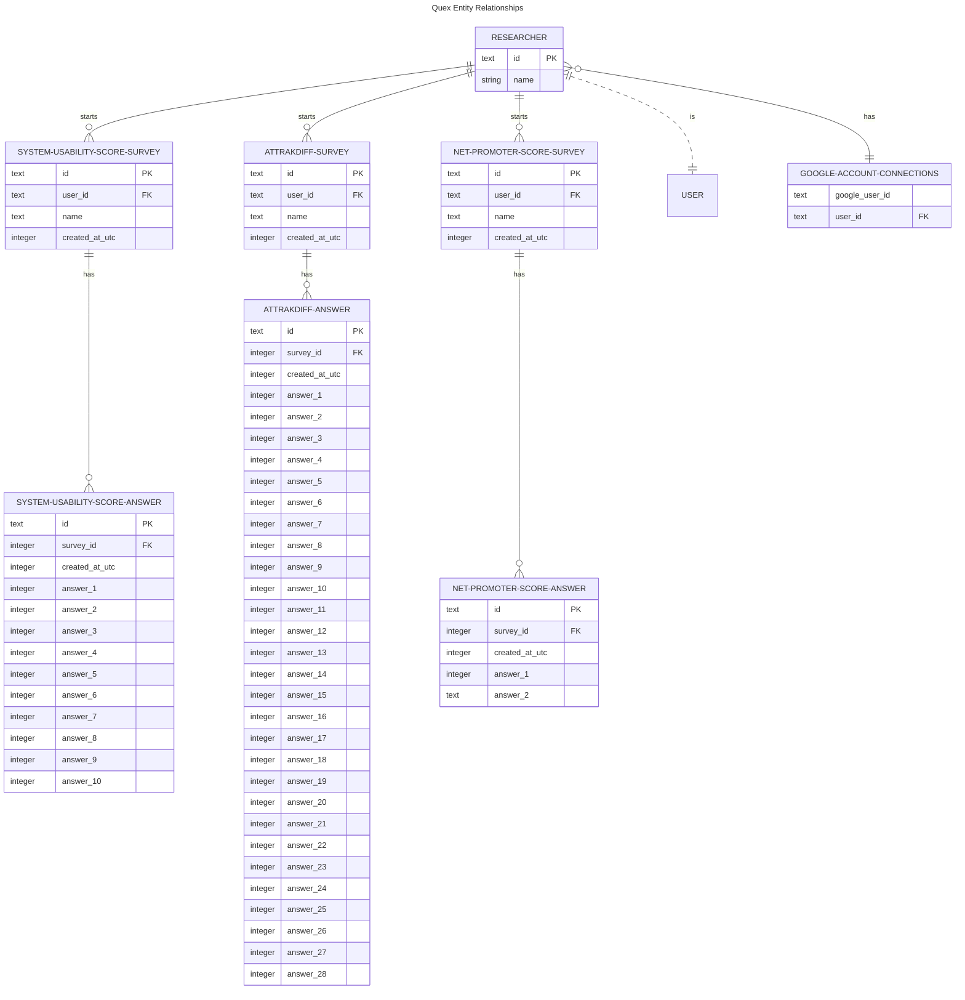

> [!NOTE]
> Diagram created with [Mermaid Entity Relationship Diagrams](https://mermaid.js.org/syntax/entityRelationshipDiagram.html)

```mermaid
---
title: Quex Entity Relationships
---

erDiagram
    RESEARCHER 1--0+ SYSTEM-USABILITY-SCORE-SURVEY : starts
    RESEARCHER 1--0+ ATTRAKDIFF-SURVEY : starts
    RESEARCHER 1--0+ NET-PROMOTER-SCORE-SURVEY : starts
    %% A researcher is a user. The other participans/subject but we don't require their data or a login as that could increase the barrier for answering a survey
    RESEARCHER 1..1 USER : is

    SYSTEM-USABILITY-SCORE-SURVEY 1--0+ SYSTEM-USABILITY-SCORE-ANSWER : has
    ATTRAKDIFF-SURVEY 1--0+ ATTRAKDIFF-ANSWER : has
    NET-PROMOTER-SCORE-SURVEY 1--0+ NET-PROMOTER-SCORE-ANSWER : has

    RESEARCHER 0+--1 GOOGLE-ACCOUNT-CONNECTIONS : has


    RESEARCHER {
        text id PK
        string name
    }

    SYSTEM-USABILITY-SCORE-SURVEY {
        text id PK
        text user_id FK
        text name
        integer created_at_utc
    }

    SYSTEM-USABILITY-SCORE-ANSWER {
        text id PK
        integer survey_id FK
        integer created_at_utc
        integer answer_1
        integer answer_2
        integer answer_3
        integer answer_4
        integer answer_5
        integer answer_6
        integer answer_7
        integer answer_8
        integer answer_9
        integer answer_10
    }

    ATTRAKDIFF-SURVEY {
        text id PK
        text user_id FK
        text name
        integer created_at_utc
    }

    ATTRAKDIFF-ANSWER {
        text id PK
        integer survey_id FK
        integer created_at_utc
        integer answer_1
        integer answer_2
        integer answer_3
        integer answer_4
        integer answer_5
        integer answer_6
        integer answer_7
        integer answer_8
        integer answer_9
        integer answer_10
        integer answer_11
        integer answer_12
        integer answer_13
        integer answer_14
        integer answer_15
        integer answer_16
        integer answer_17
        integer answer_18
        integer answer_19
        integer answer_20
        integer answer_21
        integer answer_22
        integer answer_23
        integer answer_24
        integer answer_25
        integer answer_26
        integer answer_27
        integer answer_28
    }

    NET-PROMOTER-SCORE-SURVEY {
        text id PK
        text user_id FK
        text name
        integer created_at_utc
    }

    NET-PROMOTER-SCORE-ANSWER {
        text id PK
        integer survey_id FK
        integer created_at_utc
        integer answer_1
        text answer_2
    }

    GOOGLE-ACCOUNT-CONNECTIONS {
        text google_user_id
        text user_id FK
    }


```
